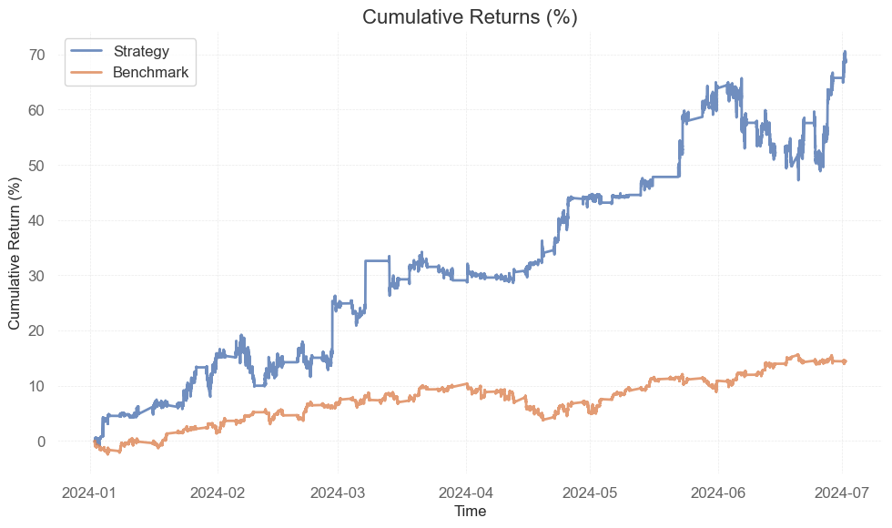
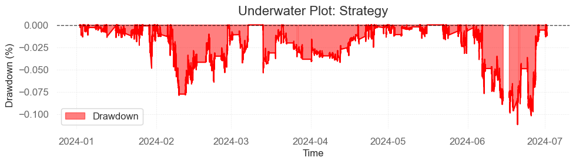
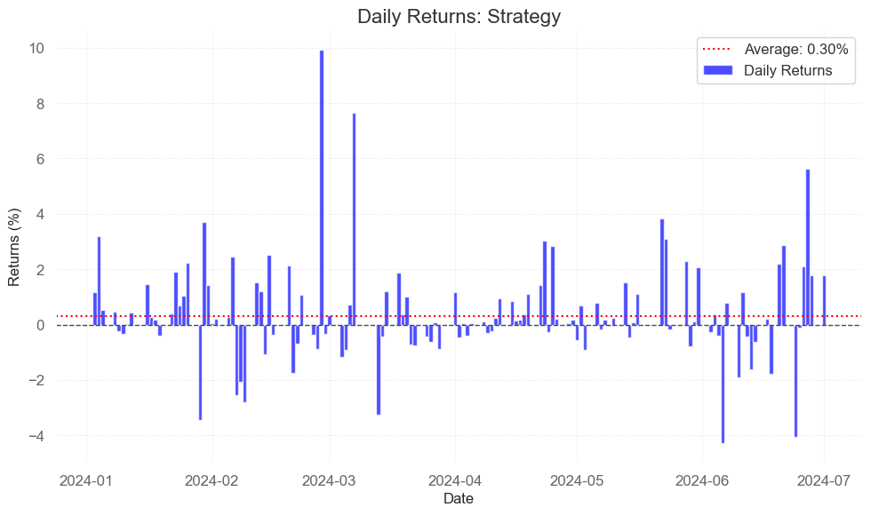

# Statistical Arbitrage: Pairs Trading Strategy Development

In this notebook, we will develop and backtest a pairs trading strategy using US stocks. The process will involve the following steps:

1. **Stock Selection**: We begin by identifying a population of the top 500 US stocks based on highest trading volume.
2. **Data Extraction**: Minutely price data for these stocks will be collected, starting from 2022.
3. **Industry Partitioning**: The selected stocks will be grouped by industry based on their SIC codes.
4. **Cointegration Testing**: For each industry group, we will test pairs of stocks for cointegration, accounting for multiple comparisons bias using the Benjamini-Hochberg process.
5. **Stationarity Testing**: For the identified cointegrated pairs, we will perform ordinary least squares (OLS) regression and use the Augmented Dickey-Fuller test to confirm stationarity, again controlling for multiple comparisons bias.
6. **Selection of Pairs**: From the pairs that pass the stationarity test, we will calculate rolling betas and z-scores, and visualize the price series and z-scores. We will then narrow down the pairs to the top 10 based on the shortest mean reversion half-life, determined using the Ornstein-Uhlenbeck process.
7. **Signal Generation**: Trading signals will be generated when the rolling z-score crosses the ±3 threshold. Positions will be closed when the z-score crosses zero.
8. **Position Sizing**: We apply fixed fraction allocation to determine the position sizing per pair.
9. **Backtesting**: Finally, we will backtest the strategy using out-of-sample data, achieving a Sharpe ratio of 2.55 and Compound Annual Growth Rate of 159.51%. 

## Performance Metrics 

| Metric                         | Benchmark | Strategy   |
|--------------------------------|-----------|------------|
| Start Period                   | 2/01/2024 | 2/01/2024  |
| End Period                     | 28/06/2024| 28/06/2024 |
| Risk-Free Rate                 | 4.00%     | 4.00%      |
| Cumulative Return              | 14.45%    | 59.44%     |
| CAGR﹪                         | 31.77%    | 159.51%    |
| Sharpe                         | 2.02      | 2.55       |
| Prob. Sharpe Ratio             | 0.00%     | 100.00%    |
| Smart Sharpe                   | 1.86      | 2.34       |
| Prob. Smart Sharpe Ratio       | 0.00%     | 100.00%    |
| Sortino                        | 2.84      | 4.03       |
| Prob. Sortino Ratio            | 0.00%     | 100.00%    |
| Smart Sortino                  | 2.62      | 3.72       |
| Prob. Smart Sortino Ratio      | 0.00%     | 100.00%    |
| Sortino/√2                     | 2.01      | 2.85       |
| Prob. Sortino/√2 Ratio         | 0.00%     | 100.00%    |
| Smart Sortino/√2               | 1.85      | 2.63       |
| Prob. Smart Sortino/√2 Ratio   | 0.00%     | 100.00%    |
| Omega                          | 1.02      | 1.03       |
| Max Drawdown                   | -6.00%    | -11.17%    |
| Longest DD Days                | 44.19     | 29         |
| Avg. Drawdown                  | -1.19%    | -2.42%     |
| Avg. Drawdown Days             | 0.39      | 0.63       |
| Recovery Factor                | 1432.55   | 5477291.6  |
| Ulcer Index                    | 0.02      | 0.03       |
| Serenity Index                 | 9.89      | 49.67      |
| Volatility (ann.)              | 12.06     | 38.81      |
| R^2                            | 0.81      | 0.94       |
| Information Ratio              | 2.35      | 2.65       |
| Calmar                         | 5.29      | 14.29      |
| Skew                           | -0.25     | 14.74      |
| Kurtosis                       | 145.19    | 1394.28    |
| Expected Daily                 | 0.08%     | 0.27%      |
| Expected Monthly               | 2.22%     | 7.94%      |
| Expected Yearly                | 31.88%    | 160.27%    |
| Kelly Criterion                | 18.98%    | 6.40%      |
| Risk of Ruin                   | 0.00%     | 0.00%      |
| Daily Value-at-Risk            | -0.98%    | -2.24%     |
| Expected Shortfall (cVaR)      | -0.27%    | -0.77%     |
| Gain/Pain Ratio                | 4.8       | 5.07       |
| Payoff Ratio                   | 0.98      | 1.03       |
| Profit Factor                  | 1.02      | 1.03       |
| Common Sense Ratio             | 5.31      | 14.37      |
| Tail Ratio                     | 0.98      | 1.03       |
| Best Day                       | 1.59%     | 9.92%      |
| Worst Day                      | -1.68%    | -4.28%     |
| Best Month                     | 5.37%     | 13.57%     |
| Worst Month                    | -4.14%    | 1.14%      |
| Best Year                      | 14.45%    | 59.44%     |
| Worst Year                     | 14.45%    | 59.44%     |

## Worst 5 Drawdowns 

| Start       | Valley      | End         | Days | Max Drawdown | 99% Max Drawdown |
|-------------|-------------|-------------|------|--------------|------------------|
| 2024-06-06  | 2024-06-20  | 2024-06-28  | 22   | -11.166140   | -9.664315        |
| 2024-02-06  | 2024-02-09  | 2024-02-28  | 23   | -7.894739    | -7.609675        |
| 2024-03-13  | 2024-03-13  | 2024-03-20  | 8    | -5.367402    | -4.733764        |
| 2024-01-29  | 2024-01-30  | 2024-01-30  | 2    | -4.883277    | -4.705171        |
| 2024-02-29  | 2024-03-05  | 2024-03-07  | 8    | -4.250805    | -3.931189        |

## Strategy Visualisation

## Trades 

| symbol | open_date                 | close_date                | open_price | close_price | position_size | profit_loss   | change_pct | trade_commission | cumulative_return |
|--------|---------------------------|---------------------------|------------|-------------|---------------|---------------|------------|------------------|-------------------|
| PAA    | 2024-01-02 04:00:00-05:00 | 2024-02-01 04:00:00-05:00 | 15.1500    | 15.4000     | 28691.074175  | 7172.768544   | 1.650165   | 87.651232        | 1.049534e+06      |
| PAGP   | 2024-01-02 04:00:00-05:00 | 2024-02-01 04:00:00-05:00 | 15.9500    | 16.1600     | -31348.000000 | -6583.080000  | -1.316614  | 100.658428       | 1.042850e+06      |
| GOOG   | 2024-01-02 08:02:00-05:00 | 2024-01-23 04:00:00-05:00 | 139.5500   | 147.5400    | 3534.007863   | 28236.722823  | 5.725546   | 101.457832       | 1.028135e+06      |
| GOOGL  | 2024-01-02 08:02:00-05:00 | 2024-01-23 04:00:00-05:00 | 139.7400   | 145.8300    | -3579.000000  | -21796.110000 | -4.358094  | 102.205503       | 1.006237e+06      |
| UA     | 2024-01-12 08:00:00-05:00 | 2024-02-15 05:58:00-05:00 | 7.5663     | 8.0800      | 56834.395728  | 29195.829085  | 6.789316   | 88.924801        | 1.071957e+06      |
| UAA    | 2024-01-12 08:00:00-05:00 | 2024-02-15 05:58:00-05:00 | 8.1100     | 7.9800      | -61936.000000 | 8051.680000   | 1.602959   | 99.655024        | 1.079909e+06      |
| TXN    | 2024-01-22 09:31:00-05:00 | 2024-03-06 04:00:00-05:00 | 175.4450   | 170.2100    | -2922.000000  | 15296.670000  | 2.983841   | 101.000391       | 1.159793e+06      |
| TPR    | 2024-01-22 09:31:00-05:00 | 2024-03-06 04:00:00-05:00 | 36.7900    | 47.7800     | 845.576402    | 9292.884659   | 29.872248  | 7.151040         | 1.144597e+06      |
| APLD   | 2024-01-24 04:53:00-05:00 | 2024-01-31 15:33:00-05:00 | 4.9000     | 5.1650      | 76.196023     | 20.191946     | 5.408163   | 0.076691         | 1.006257e+06      |
| SNOW   | 2024-01-24 04:53:00-05:00 | 2024-01-31 15:33:00-05:00 | 210.5000   | 195.8600    | -2479.000000  | 36292.560000  | 6.954869   | 100.736644       | 1.042449e+06      |
| APLD   | 2024-02-02 12:19:00-05:00 | 2024-02-28 16:05:00-05:00 | 4.8750     | 4.3900      | -120.914818   | 58.643687     | 9.948718   | 0.112028         | 1.079968e+06      |
| SNOW   | 2024-02-02 12:19:00-05:00 | 2024-02-28 16:05:00-05:00 | 217.6600   | 196.0000    | -2560.000000  | 55449.600000  | 9.951300   | 105.896960       | 1.135311e+06      |
| COMP   | 2024-02-06 08:07:00-05:00 | 2024-03-07 16:05:00-05:00 | 3.4600     | 3.7400      | 203.840144    | 57.075240     | 8.092486   | 0.146765         | 1.159850e+06      |
| DOCU   | 2024-02-06 08:07:00-05:00 | 2024-03-07 16:05:00-05:00 | 50.6000    | 61.0000     | 11022.000000  | 114628.800000 | 20.553360  | 123.005520       | 1.274356e+06      |
| LBRT   | 2024-03-13 04:00:00-04:00 | 2024-04-02 04:00:00-04:00 | 21.4000    | 20.9700     | 29803.000000  | -12815.290000 | -2.009346  | 126.275311       | 1.278052e+06      |
| AM     | 2024-03-13 04:00:00-04:00 | 2024-04-02 04:00:00-04:00 | 13.5700    | 14.1600     | -18032.669780 | -10639.275170 | -4.347826  | 50.004593        | 1.290994e+06      |
| CVX    | 2024-03-13 09:01:00-04:00 | 2024-04-16 10:27:00-04:00 | 153.1186   | 155.8100    | -4159.000000  | -11193.532600 | -1.757722  | 128.483405       | 1.269024e+06      |
| BTU    | 2024-03-13 09:01:00-04:00 | 2024-04-16 10:27:00-04:00 | 25.3000    | 23.2850     | -1141.067267  | 2299.250542   | 7.964427   | 5.543875         | 1.280346e+06      |
| GOOG   | 2024-03-18 08:04:00-04:00 | 2024-03-18 08:06:00-04:00 | 142.9900   | 149.5600    | 4254.994861   | 27955.316235  | 4.594727   | 124.479875       | 1.302186e+06      |
| GOOGL  | 2024-03-18 08:04:00-04:00 | 2024-03-18 08:06:00-04:00 | 148.6589   | 148.7500    | -4164.000000  | -379.340400   | -0.061281  | 123.841066       | 1.301683e+06      |
| PAA    | 2024-04-15 04:00:00-04:00 | 2024-05-07 04:00:00-04:00 | 17.8200    | 17.5400     | 31756.208334  | -8891.738334  | -1.571268  | 112.289953       | 1.370628e+06      |
| PAGP   | 2024-04-15 04:00:00-04:00 | 2024-05-07 04:00:00-04:00 | 18.7600    | 18.3700     | -33478.000000 | 13056.420000  | 2.078891   | 124.303814       | 1.383560e+06      |
| APLD   | 2024-04-19 08:01:00-04:00 | 2024-04-25 16:03:00-04:00 | 2.3800     | 3.0000      | -524.687946   | -325.306527   | -26.050420 | 0.282282         | 1.268698e+06      |
| SNOW   | 2024-04-19 08:01:00-04:00 | 2024-04-25 16:03:00-04:00 | 142.0000   | 156.2500    | 4479.000000   | 63825.750000  | 10.035211  | 133.586175       | 1.332391e+06      |
| COMP   | 2024-04-22 09:35:00-04:00 | 2024-04-25 17:03:00-04:00 | 3.2500     | 3.2200      | -1143.509626  | 34.305289     | 0.923077   | 0.739851         | 1.332424e+06      |
| DOCU   | 2024-04-22 09:35:00-04:00 | 2024-04-25 17:03:00-04:00 | 54.7900    | 58.8000     | 11806.000000  | 47342.060000  | 7.318854   | 134.104354       | 1.379632e+06      |
| GOOGL  | 2024-04-25 08:03:00-04:00 | 2024-05-10 08:01:00-04:00 | 153.7100   | 169.3700    | 4377.000000   | 68543.820000  | 10.188016  | 141.412116       | 1.388075e+06      |
| GOOG   | 2024-04-25 08:03:00-04:00 | 2024-05-10 08:01:00-04:00 | 156.4000   | 170.4600    | -4533.381161  | -63739.339130 | -8.989770  | 148.178097       | 1.319673e+06      |
| UA     | 2024-05-13 05:19:00-04:00 | 2024-05-16 04:01:00-04:00 | 6.5100     | 6.8800      | 87548.490267  | 32392.941399  | 5.683564   | 117.227428       | 1.420351e+06      |
| UAA    | 2024-05-13 05:19:00-04:00 | 2024-05-16 04:01:00-04:00 | 6.8800     | 6.8900      | -101051.000000| -1010.510000  | -0.145349  | 139.147227       | 1.419201e+06      |
| UA     | 2024-05-22 08:05:00-04:00 | 2024-05-29 04:00:00-04:00 | 6.6300     | 6.5600      | -108623.990360| 7603.679325   | 1.055807   | 143.275043       | 1.521556e+06      |
| UAA    | 2024-05-22 08:05:00-04:00 | 2024-05-29 04:00:00-04:00 | 6.6700     | 6.8301      | 106586.000000 | 17064.418600  | 2.400300   | 143.892166       | 1.538477e+06      |
| AM     | 2024-05-22 09:48:00-04:00 | 2024-05-31 15:53:00-04:00 | 14.7363    | 14.5650     | -12524.229774 | 2145.400560   | 1.162436   | 36.697621        | 1.540585e+06      |
| LBRT   | 2024-05-22 09:48:00-04:00 | 2024-05-31 15:53:00-04:00 | 23.5800    | 24.7000     | 30522.000000  | 34184.640000  | 4.749788   | 147.360216       | 1.574623e+06      |
| APLD   | 2024-05-22 16:05:00-04:00 | 2024-05-23 09:39:00-04:00 | 4.4500     | 4.3900      | 321.989195    | -19.319352    | -1.348315  | 0.284638         | 1.419182e+06      |
| SNOW   | 2024-05-22 16:05:00-04:00 | 2024-05-23 09:39:00-04:00 | 181.0200   | 156.8350    | -3930.000000  | 95047.050000  | 13.360402  | 132.777015       | 1.514096e+06      |
| UA     | 2024-05-31 04:00:00-04:00 | 2024-06-26 04:00:00-04:00 | 6.7100     | 6.8100      | 89341.060703  | 8934.106070   | 1.490313   | 120.789114       | 1.583436e+06      |
| UAA    | 2024-05-31 04:00:00-04:00 | 2024-06-26 04:00:00-04:00 | 6.9400     | 6.9200      | -111280.000000| 2225.600000   | 0.288184   | 154.234080       | 1.585507e+06      |

